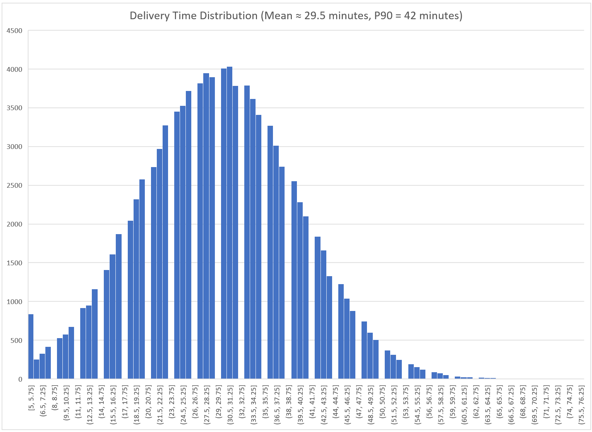
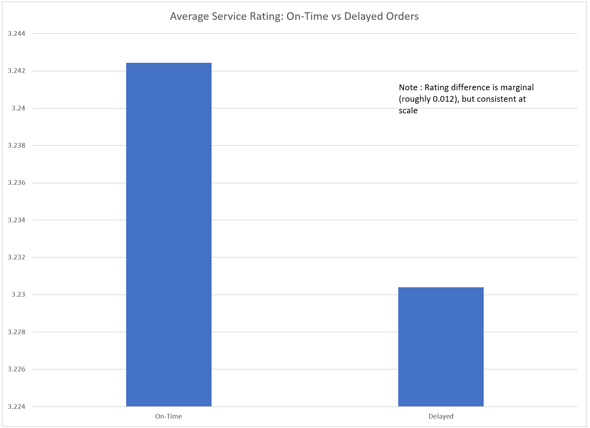
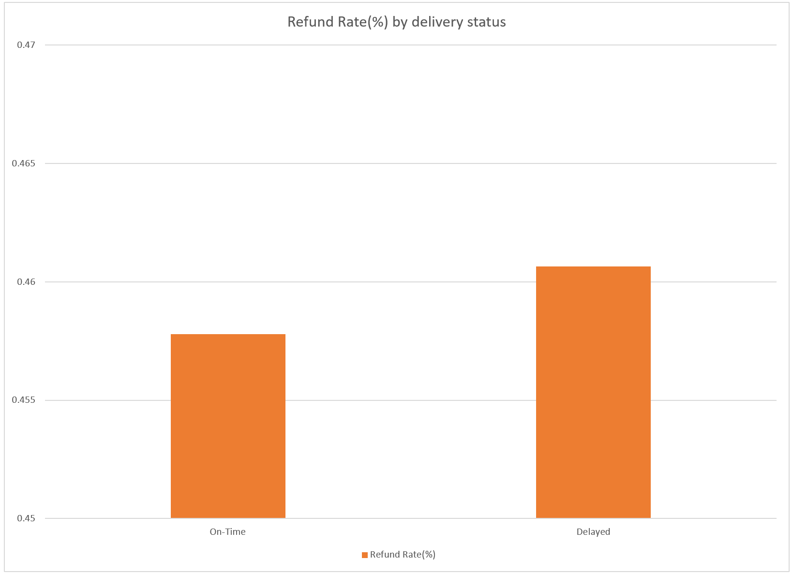
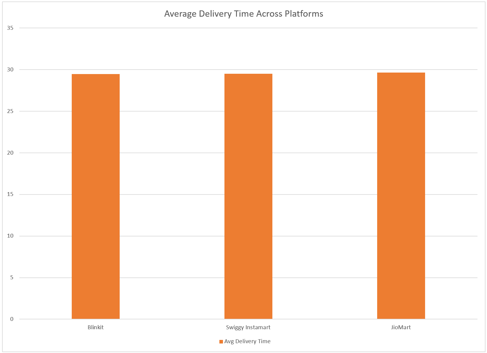

# Quick-Commerce Delivery Time Analysis

This project looks at delivery-time performance in quick-commerce platforms using a public dataset.  
The focus is on understanding **delivery delays**, **slow orders**, and why **average delivery time alone is not enough** to judge operational performance.

The analysis is exploratory and operational in nature, not predictive.

---

## Dataset

- **Source:** Public Kaggle dataset (E-commerce Delivery Analytics)
- **Orders:** 100,000
- **Platforms:** Blinkit, Swiggy Instamart, JioMart

**Main fields used:**
- Delivery Time (Minutes)
- Delivery Delay (Yes/No)
- Service Rating
- Refund Requested
- Platform

**Note:**  
Order placement timestamps are not reliable in this dataset, so the analysis focuses on delivery duration and delay behavior rather than time-of-day patterns.

---

## High-Level Metrics

| Metric | Value |
|------|------|
| Average Delivery Time | ~29.5 minutes |
| Median Delivery Time | 30 minutes |
| P90 Delivery Time | 42 minutes |
| Delay Rate | 13.67% |

---

## Delivery Time Distribution

Most orders are delivered close to the 30-minute mark.  
However, the slowest orders take much longer.

- Median delivery time: **30 minutes**
- P90 delivery time: **42 minutes**

This means the slowest 10% of orders take **at least 12 minutes longer** than a typical order.

**Why this matters:**  
Customers and operations teams usually feel the impact of these slow orders, not the average ones.

---

## Delays and Delivery Risk

Around **13.7% of orders are marked as delayed**, which closely matches the slow end of the delivery-time distribution.

This suggests that delays are not random issues, but tend to occur once delivery time crosses a certain threshold.

---

## Customer Impact of Delays

At an individual order level, delays do not drastically change outcomes, but the impact is still visible.

### Average Service Rating

- On-time orders: ~3.24
- Delayed orders: ~3.23

### Refund Rate

- On-time orders: ~0.46%
- Delayed orders: ~0.46% (slightly higher)

The difference per order is small, but since **more than 1 in 8 orders are delayed**, these small effects can add up at scale.

A simple calculation also shows that **refunds alone do not explain the full cost of delays**, suggesting most impact is operational or long-term.

---

## Comparison Across Platforms

Average delivery times across platforms are very similar.

This shows that comparing platforms using averages alone does not reveal much.  
Looking at slow orders and delay rates provides more useful insight.

---

## Key Takeaways

- Average delivery time hides slow and problematic orders.
- Tracking slow deliveries (for example, P90) gives a better view of risk.
- Delays are frequent enough to matter at scale.
- Most delay-related cost is likely indirect, not just refunds.

---

## Tools Used

- Excel for calculations, pivot tables, and charts
- Public dataset from Kaggle(https://www.kaggle.com/datasets/logiccraftbyhimanshi/e-commerce-analytics-swiggy-zomato-blinkit)

---

## Final Note

This project was done to practice thinking about delivery operations using real-world data.  
The goal is to focus on **how systems behave at scale**, rather than on optimizing a single metric.
